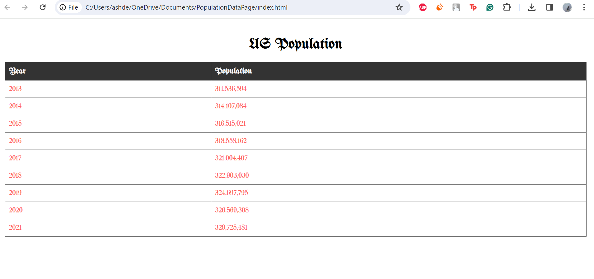

## Population Data Page

This is an HTML page containing population data. The website utilizes an API endpoint containing population data.
This program uses HTML code to create a title, table, rows and columns to display data. The site's colors are customized to fit a gothic aesthetic.
A custom font "UnifrakturMaguntia" is also imported from Google Fonts to fit the aesthetic. There is also a hover feature that changes the color of rows when the cursor hovers over them.

## Files

- [Website Screenshot](website_picture.png):

- [Code Screenshot 1](picture_of_code.png):

- [Code Screenshot 2](picture_of_code2.png): 
